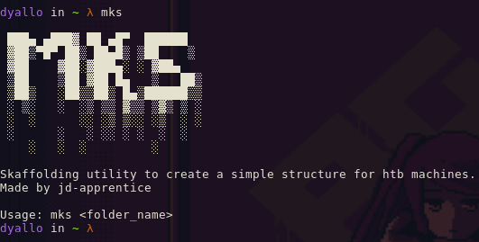

# hacking-tools

A suite of hacking tools for my personal usage


## Get Me Ports

After doing a `nmap` scan, you can use `get-me-ports` to only display relevant information.



## Mks

A simple script to create a scaffold for your htb machines.


## File Structure

Structure is as follows:

```
🌳 hacking-tools/
┣ 📁 .github/
┃ ┗ 📁 workflows/
┃   ┗ 📄 get-me-ports.yml
┣ 📁 apps/
┃ ┣ 📁 get_me_ports/
┃ ┃ ┣ 📁 linux/
┃ ┃ ┃ ┗ 📄 get-me-ports_x86_64
┃ ┃ ┗ 📁 windows/
┃ ┃   ┗ 📄 get-me-ports_x86_64.exe
┃ ┣ 📁 mks/
┃ ┃ ┣ 📁 linux/
┃ ┃ ┃ ┗ 📄 mks_x86_64
┃ ┃ ┗ 📁 windows/
┃ ┃   ┗ 📄 mks_x86_64.exe
┃ ┣ 📄 get-me-ports.zig
┃ ┣ 📄 mks.zig
┃ ┗ 📄 utils.zig
┣ 📁 assets/
┃ ┣ 📄 get_me_ports.png
┃ ┣ 📄 mks.png
┃ ┗ 📄 wallpaper.jpg
┣ 📄 .gitignore
┣ 📄 Makefile
┣ 📄 README.md
┗ 📄 sampleScan
```

## Links

- https://nofmal.github.io/zig-with-example/string-handling/
- https://zighelp.org/chapter-3/#cross-compilation
- https://zig.guide/
- https://ziglang.org/documentation/0.11.0/#Introduction
- https://ziggit.dev/